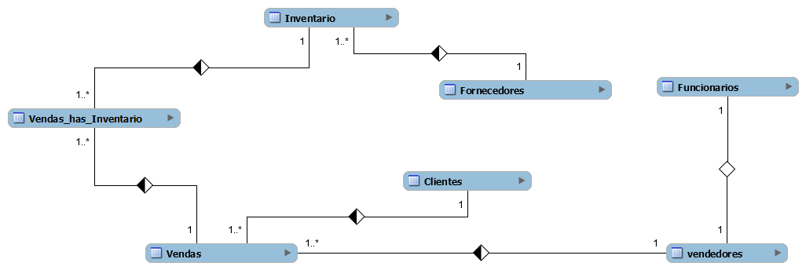
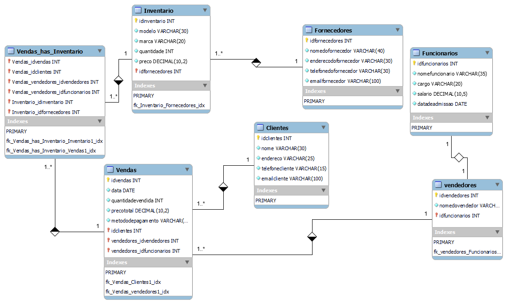

# Estudo de caso
## Caso bike shop

Empresa: BikeShop

### Visão Geral:

A BikeShop é uma empresa especializada na venda de bicicletas e acessórios relacionados. 
Localizada em uma área urbana movimentada de Uberlândia, Minas Gerais, a empresa tem 
como objetivo oferecer uma variedade de bicicletas de alta qualidade para ciclistas de todos os 
níveis, desde iniciantes até ciclistas experientes e entusiastas.

### Desafio:

A BikeShop está crescendo rapidamente e enfrenta desafios no gerenciamento eficiente de seu 
inventário, clientes e vendas. Atualmente, eles estão registrando essas informações 
manualmente ou usando planilhas eletrônicas, o que se tornou ineficiente e propenso a erros. 
Eles reconhecem a necessidade de um sistema de banco de dados centralizado que possa 
armazenar e gerenciar essas informações de forma mais eficaz.

### Objetivos do Sistema de Banco de Dados:

Gerenciar o inventário de bicicletas e acessórios, incluindo detalhes como modelo, marca, 
quantidade em estoque, preço de venda e fornecedor.
Manter um registro centralizado de clientes, incluindo informações como nome, endereço, 
número de telefone, endereço de e-mail e histórico de compras.
Registrar e acompanhar as vendas de bicicletas e acessórios, incluindo detalhes como data da 
venda, produtos vendidos, preço de venda, método de pagamento e vendedor responsável.

### Requisitos Funcionais do Sistema de Banco de Dados:

Capacidade de adicionar, atualizar e excluir itens do inventário, bem como verificar a 
disponibilidade de produtos em tempo real.
Capacidade de adicionar novos clientes, atualizar informações existentes e manter um histórico 
de suas compras anteriores.
Funcionalidade para registrar novas vendas, incluindo a associação dos produtos vendidos aos 
clientes correspondentes e a geração de recibos.
Recursos de segurança para proteger os dados do cliente e do inventário contra acesso não 
autorizado.
Capacidade de gerar relatórios de vendas, análises de estoque e dados do cliente para ajudar 
na tomada de decisões comerciais.

### Abordagem Proposta:

A BikeShop planeja desenvolver um sistema de banco de dados personalizado usando 
tecnologias modernas de banco de dados, como MySQL ou PostgreSQL. Eles planejam 
colaborar com desenvolvedores de software especializados para projetar e implementar o 
sistema de acordo com seus requisitos específicos. O sistema será acessado por funcionários 
autorizados por meio de uma interface de usuário intuitiva, onde poderão realizar todas as 
operações necessárias de forma eficiente.

### Benefícios Esperados:

Melhoria na eficiência operacional, permitindo que a BikeShop gerencie seu inventário, clientes 
e vendas de forma mais rápida e precisa.
Maior satisfação do cliente, oferecendo um serviço mais personalizado e mantendo um 
histórico detalhado das interações anteriores.
Melhoria na tomada de decisões comerciais com base em relatórios e análises de dados 
precisos e atualizados.
Com um sistema de banco de dados eficiente e bem projetado, a BikeShop está confiante de 
que poderá atender às demandas de seus clientes de maneira mais eficaz e continuar 
prosperando no mercado de bicicletas.


### Relacionamentos:
Um fornecedor pode fornecer múltiplos itens de inventário, mas cada item de inventário é 
fornecido por apenas um fornecedor. (Relacionamento um para muitos entre Fornecedores e 
Inventário)

Um cliente pode fazer várias compras, mas cada compra é feita por apenas um cliente. 
(Relacionamento um para muitos entre Clientes e Vendas)

Cada venda inclui vários itens de inventário, e cada item de inventário pode estar presente em 
várias vendas. (Relacionamento muitos para muitos entre Vendas e Inventário)

Um vendedor pode fazer várias vendas, mas cada venda é realizada por apenas um vendedor. 
(Relacionamento um para muitos entre Vendedores e Vendas)

Cada vendedor é associado a apenas um funcionário. (Relacionamento um para um entre 
Funcionários e Vendedores)

Este modelo lógico de banco de dados reflete as entidades principais e seus relacionamentos 
no contexto da BikeShop, permitindo a organização eficiente dos dados e a realização de 
operações de negócios necessária.

### Com base nos dados acima, foi construído um modelo conceitual e lógico para atender a Bike shop

# Modelo Conceitual
 

# Modelo Lógico 
 

# Código SQL para modelo físico do banco de dados
```
-- MySQL Workbench Forward Engineering

SET @OLD_UNIQUE_CHECKS=@@UNIQUE_CHECKS, UNIQUE_CHECKS=0;
SET @OLD_FOREIGN_KEY_CHECKS=@@FOREIGN_KEY_CHECKS, FOREIGN_KEY_CHECKS=0;
SET @OLD_SQL_MODE=@@SQL_MODE, SQL_MODE='ONLY_FULL_GROUP_BY,STRICT_TRANS_TABLES,NO_ZERO_IN_DATE,NO_ZERO_DATE,ERROR_FOR_DIVISION_BY_ZERO,NO_ENGINE_SUBSTITUTION';

-- -----------------------------------------------------
-- Schema mydb
-- -----------------------------------------------------

-- -----------------------------------------------------
-- Schema mydb
-- -----------------------------------------------------
CREATE SCHEMA IF NOT EXISTS `mydb` DEFAULT CHARACTER SET utf8 ;
USE `mydb` ;

-- -----------------------------------------------------
-- Table `mydb`.`Inventario`
-- -----------------------------------------------------
CREATE TABLE IF NOT EXISTS `mydb`.`Inventario` (
  `idinventario` INT NOT NULL AUTO_INCREMENT,
  `modelo` VARCHAR(30) NOT NULL,
  `marca` VARCHAR(20) NOT NULL,
  `quantidade` INT NOT NULL,
  `preco` DECIMAL(10,2) NOT NULL,
  `idfornecedores` INT NOT NULL,
  PRIMARY KEY (`idinventario`, `idfornecedores`),
  INDEX `fk_Inventario_Fornecedores_idx` (`idfornecedores` ASC) VISIBLE,
  CONSTRAINT `fk_Inventario_Fornecedores`
    FOREIGN KEY (`idfornecedores`)
    REFERENCES `mydb`.`Fornecedores` (`idfornecedores`)
    ON DELETE NO ACTION
    ON UPDATE NO ACTION)
ENGINE = InnoDB;


-- -----------------------------------------------------
-- Table `mydb`.`Fornecedores`
-- -----------------------------------------------------
CREATE TABLE IF NOT EXISTS `mydb`.`Fornecedores` (
  `idfornecedores` INT NOT NULL AUTO_INCREMENT,
  `nomedofornecedor` VARCHAR(40) NOT NULL,
  `enderecodofornecedor` VARCHAR(30) NOT NULL,
  `telefonedofornecedor` VARCHAR(30) NOT NULL,
  `emailfornecedor` VARCHAR(100) NOT NULL,
  PRIMARY KEY (`idfornecedores`))
ENGINE = InnoDB;


-- -----------------------------------------------------
-- Table `mydb`.`Inventario`
-- -----------------------------------------------------
CREATE TABLE IF NOT EXISTS `mydb`.`Inventario` (
  `idinventario` INT NOT NULL AUTO_INCREMENT,
  `modelo` VARCHAR(30) NOT NULL,
  `marca` VARCHAR(20) NOT NULL,
  `quantidade` INT NOT NULL,
  `preco` DECIMAL(10,2) NOT NULL,
  `idfornecedores` INT NOT NULL,
  PRIMARY KEY (`idinventario`, `idfornecedores`),
  INDEX `fk_Inventario_Fornecedores_idx` (`idfornecedores` ASC) VISIBLE,
  CONSTRAINT `fk_Inventario_Fornecedores`
    FOREIGN KEY (`idfornecedores`)
    REFERENCES `mydb`.`Fornecedores` (`idfornecedores`)
    ON DELETE NO ACTION
    ON UPDATE NO ACTION)
ENGINE = InnoDB;


-- -----------------------------------------------------
-- Table `mydb`.`Clientes`
-- -----------------------------------------------------
CREATE TABLE IF NOT EXISTS `mydb`.`Clientes` (
  `idclientes` INT NOT NULL AUTO_INCREMENT,
  `nome` VARCHAR(30) NOT NULL,
  `endereco` VARCHAR(25) NOT NULL,
  `telefonecliente` VARCHAR(15) NOT NULL,
  `emailcliente` VARCHAR(100) NOT NULL,
  PRIMARY KEY (`idclientes`))
ENGINE = InnoDB;


-- -----------------------------------------------------
-- Table `mydb`.`Funcionarios`
-- -----------------------------------------------------
CREATE TABLE IF NOT EXISTS `mydb`.`Funcionarios` (
  `idfuncionarios` INT NOT NULL AUTO_INCREMENT,
  `nomefuncionario` VARCHAR(35) NOT NULL,
  `cargo` VARCHAR(20) NOT NULL,
  `salario` DECIMAL(10,5) NOT NULL,
  `datadeadmissao` DATE NOT NULL,
  PRIMARY KEY (`idfuncionarios`))
ENGINE = InnoDB;


-- -----------------------------------------------------
-- Table `mydb`.`vendedores`
-- -----------------------------------------------------
CREATE TABLE IF NOT EXISTS `mydb`.`vendedores` (
  `idvendedores` INT NOT NULL AUTO_INCREMENT,
  `nomedovendedor` VARCHAR(35) NOT NULL,
  `idfuncionarios` INT NOT NULL,
  PRIMARY KEY (`idvendedores`, `idfuncionarios`),
  INDEX `fk_vendedores_Funcionarios1_idx` (`idfuncionarios` ASC) VISIBLE,
  CONSTRAINT `fk_vendedores_Funcionarios1`
    FOREIGN KEY (`idfuncionarios`)
    REFERENCES `mydb`.`Funcionarios` (`idfuncionarios`)
    ON DELETE NO ACTION
    ON UPDATE NO ACTION)
ENGINE = InnoDB;


-- -----------------------------------------------------
-- Table `mydb`.`Vendas`
-- -----------------------------------------------------
CREATE TABLE IF NOT EXISTS `mydb`.`Vendas` (
  `idvendas` INT NOT NULL AUTO_INCREMENT,
  `data` DATE NOT NULL,
  `quantidadevendida` INT NOT NULL,
  `precototal` DECIMAL(10,2) NOT NULL,
  `metododepagamento` VARCHAR(30) NOT NULL,
  `idclientes` INT NOT NULL,
  `vendedores_idvendedores` INT NOT NULL,
  `vendedores_idfuncionarios` INT NOT NULL,
  PRIMARY KEY (`idvendas`, `idclientes`, `vendedores_idvendedores`, `vendedores_idfuncionarios`),
  INDEX `fk_Vendas_Clientes1_idx` (`idclientes` ASC) VISIBLE,
  INDEX `fk_Vendas_vendedores1_idx` (`vendedores_idvendedores` ASC, `vendedores_idfuncionarios` ASC) VISIBLE,
  CONSTRAINT `fk_Vendas_Clientes1`
    FOREIGN KEY (`idclientes`)
    REFERENCES `mydb`.`Clientes` (`idclientes`)
    ON DELETE NO ACTION
    ON UPDATE NO ACTION,
  CONSTRAINT `fk_Vendas_vendedores1`
    FOREIGN KEY (`vendedores_idvendedores` , `vendedores_idfuncionarios`)
    REFERENCES `mydb`.`vendedores` (`idvendedores` , `idfuncionarios`)
    ON DELETE NO ACTION
    ON UPDATE NO ACTION)
ENGINE = InnoDB;


-- -----------------------------------------------------
-- Table `mydb`.`Vendas_has_Inventario`
-- -----------------------------------------------------
CREATE TABLE IF NOT EXISTS `mydb`.`Vendas_has_Inventario` (
  `Vendas_idvendas` INT NOT NULL,
  `Vendas_idclientes` INT NOT NULL,
  `Vendas_vendedores_idvendedores` INT NOT NULL,
  `Vendas_vendedores_idfuncionarios` INT NOT NULL,
  `Inventario_idinventario` INT NOT NULL,
  `Inventario_idfornecedores` INT NOT NULL,
  PRIMARY KEY (`Vendas_idvendas`, `Vendas_idclientes`, `Vendas_vendedores_idvendedores`, `Vendas_vendedores_idfuncionarios`, `Inventario_idinventario`, `Inventario_idfornecedores`),
  INDEX `fk_Vendas_has_Inventario_Inventario1_idx` (`Inventario_idinventario` ASC, `Inventario_idfornecedores` ASC) VISIBLE,
  INDEX `fk_Vendas_has_Inventario_Vendas1_idx` (`Vendas_idvendas` ASC, `Vendas_idclientes` ASC, `Vendas_vendedores_idvendedores` ASC, `Vendas_vendedores_idfuncionarios` ASC) VISIBLE,
  CONSTRAINT `fk_Vendas_has_Inventario_Vendas1`
    FOREIGN KEY (`Vendas_idvendas` , `Vendas_idclientes` , `Vendas_vendedores_idvendedores` , `Vendas_vendedores_idfuncionarios`)
    REFERENCES `mydb`.`Vendas` (`idvendas` , `idclientes` , `vendedores_idvendedores` , `vendedores_idfuncionarios`)
    ON DELETE NO ACTION
    ON UPDATE NO ACTION,
  CONSTRAINT `fk_Vendas_has_Inventario_Inventario1`
    FOREIGN KEY (`Inventario_idinventario` , `Inventario_idfornecedores`)
    REFERENCES `mydb`.`Inventario` (`idinventario` , `idfornecedores`)
    ON DELETE NO ACTION
    ON UPDATE NO ACTION)
ENGINE = InnoDB;


SET SQL_MODE=@OLD_SQL_MODE;
SET FOREIGN_KEY_CHECKS=@OLD_FOREIGN_KEY_CHECKS;
SET UNIQUE_CHECKS=@OLD_UNIQUE_CHECKS;


```


